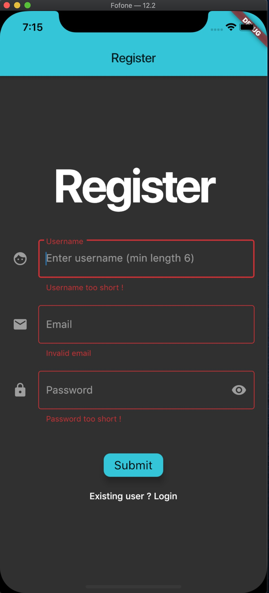
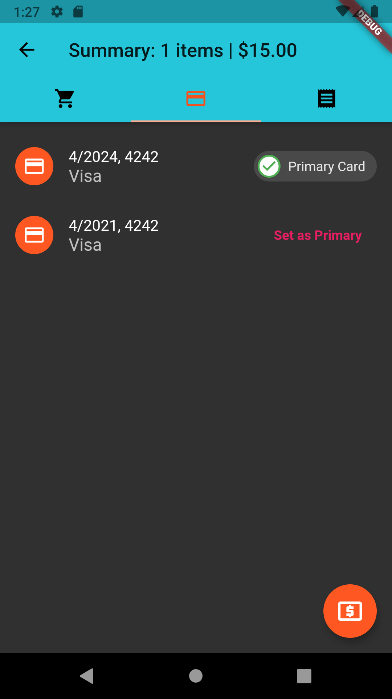

# flutter_ecommerce

A full-stack e-commerce mobile application, with a complete shopping cart for authenticated users.

Complete app with an eye-catching UI using :  
Flutter Material Library  
Redux for global state management  
Redux Thunk for async actions  
Complete API with custom controllers with the help of Strapi  
App data stored in a sqlite database  
User Authentication with Register / Login.

